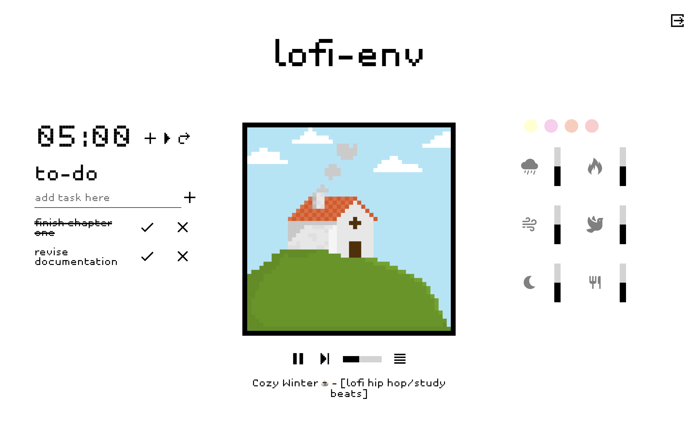

# lofi-env
## About The Project
Lo-fi and pixel-art themed virtual study environment, equipped with a editable lofi radio, timer, to-do list and relaxing sound effects. 

Users can create an account and login to save their settings.

Check out the web application at: [**https://lofi-env.herokuapp.com/**](https://lofi-env.herokuapp.com/)

 

## Technologies
**Frontend:**
- React.js
- Redux Toolkit
- Styled Components (CSS-in-JS)

**Backend:**
- Node.js
- Express.js
- MongoDB

Deployed on: Heroku

## Roadmap
- [x] Complete front end with React.js
- [x] Complete back end & api
- [x] Add user authorisation & authentication
- [x] Add front end global state management
- [x] Add color picker feature
- [x] Add playlist feature
- [x] Add CRUD operations to to-do list, playlist and colour picker
- [x] Add more visually appealing modals instead of js alerts
- [ ] Add about section and general information
- [ ] Animate pixel art
- [ ] Add login as guest functionality
- [ ] Modify application behaviour to reflect global state before api requests rather than after as it currently is (will result in a much smoother experience for the user

