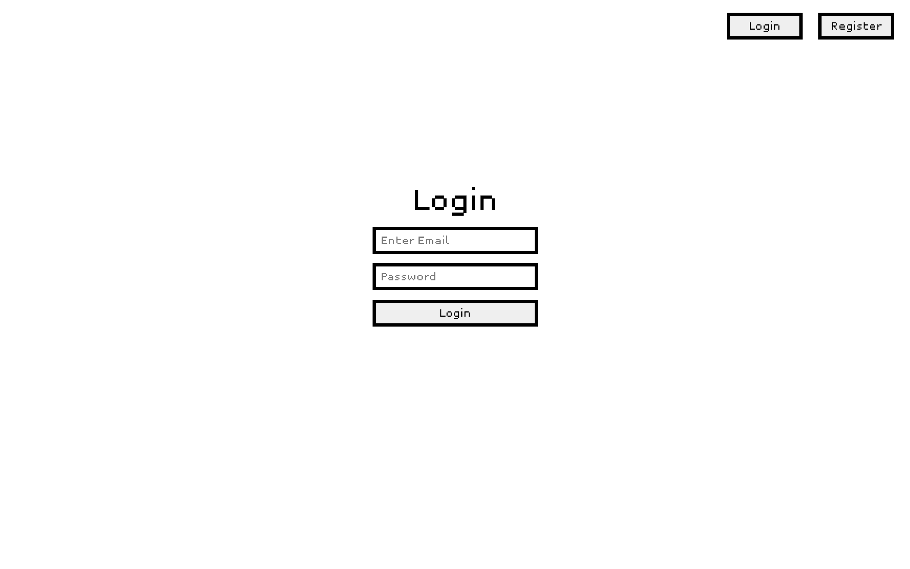
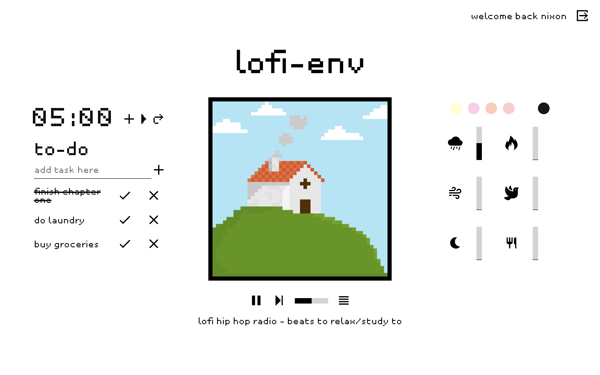
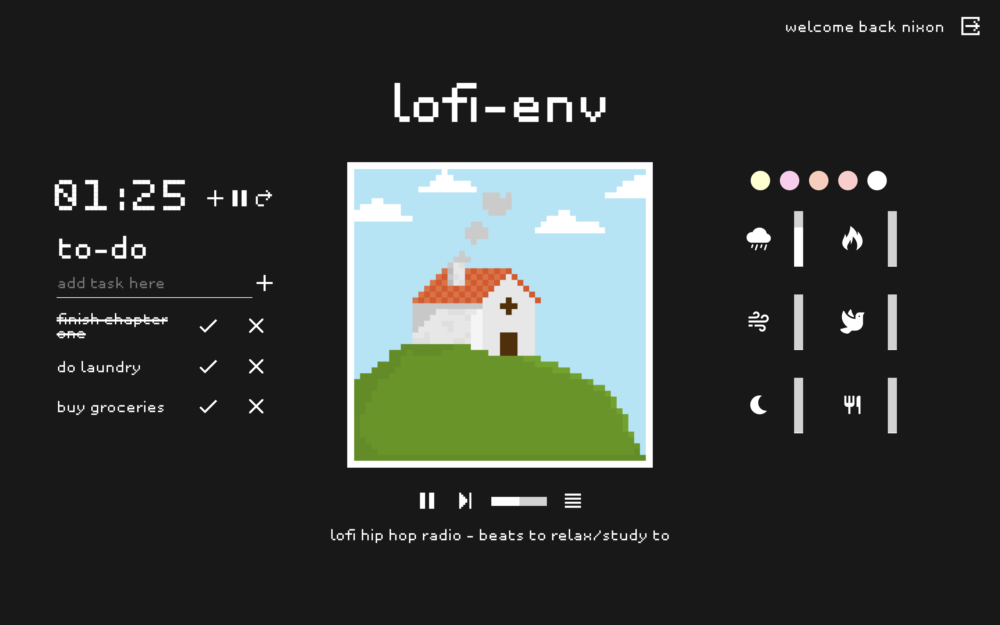
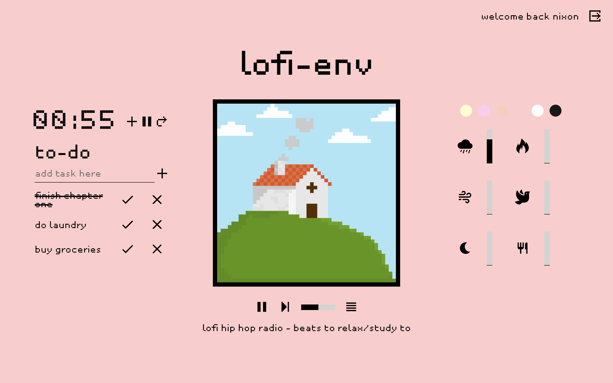

# lofi-env
## About The Project
Lo-fi and pixel-art themed virtual study environment, equipped with an editable lofi radio, timer, to-do list and relaxing sound effects.

Users can create an account and login to save their settings.

Check out the web application at: [**https://www.lofi-env.com/**](https://www.lofi-env.com/)

 

## Features
- User authorisation & authentication
- Simple timer
- Customisable playlist that allows users to paste in their own youtube links to listen to
- Controllable radio that plays directly from the playlist
- To-do list that allows users to input tasks and mark tasks as done
- Customisable background color via an interactive color picker
- Adjustable sound effects that allows users to craft their own ambient sounds
- CRUD operations on all features

## Technologies
**Frontend:**
- TypeScript
- React.js
- Redux Toolkit
- Styled Components (CSS-in-JS)

**Backend:**
- TypeScript
- Node.js
- Express.js
- MongoDB

Deployed on: Heroku

## Design and Architecture
### Data Model

## Roadmap
- [x] Complete front end with React.js
- [x] Migrated front end application to TypeScript
- [x] Complete back end & api
- [x] Add user authorisation & authentication
- [x] Add front end global state management
- [x] Add color picker feature
- [x] Add playlist feature
- [x] Add CRUD operations to to-do list, playlist and colour picker
- [x] Add more visually appealing modals instead of js alerts
- [ ] Add about section and general information
- [x] Animate pixel art
- [x] Optimise size of assets for faster load (website now loads 4x faster)
- [ ] Add login as guest functionality
- [x] Add loading screen to cover assets not yet loaded
- [ ] Modify application behaviour to reflect global state before api requests rather than after as it currently is (will result in a much smoother experience for the user)

## User testing
- [ ] Change description of playlist feature (user got confused and pasted in a youtube playlist link instead)
- [x] Default sound effects to play on low vol, and have audio turn off when slider value reaches 0
  - Makes the sound players more intuitive to operate (user wasn't aware they could turn on off the sound effects by toggling icons)
- [ ] Load time is slow
  - Consider adding a loading screen before complete render of content
  - Consider code splitting
- [ ] Color picker is difficult to see
  - Consider having a button that cycles through colors
- [x] Minor styling flaws:
  - White border around pixel art
  - Optically unbalanced nav (login, register buttons)
- [x] DARK MODE!
- [ ] Need a mute button for sound players to turn off
- [ ] Confirm logout modal to prevent accidental user logouts
- [ ] Keyboard shortcuts would simplify the control of the site
  - Would then also involve an instruction section for the keys

